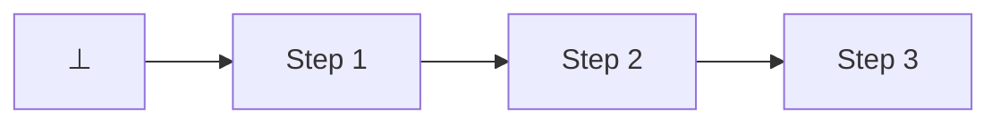
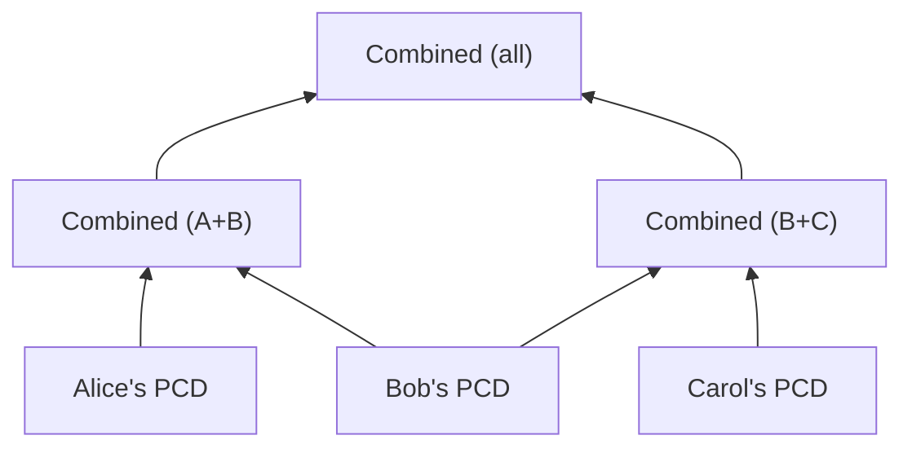

# Proof-carrying data

**Proof-carrying data (PCD)** is a cryptographic primitive in which data carries
a proof of the entire computational history that produced it. In traditional
[verifiable computation](https://en.wikipedia.org/wiki/Verifiable_computing), a
[(S)NARK](../appendix/snarks.md) is attached to a piece of data as a one-shot
attestation that some computation was performed correctly. PCD takes this
further: it is organized around a _transition predicate_ that must hold over old
and new data. At each step of a computation, one or more prior PCD instances are
consumed and a new instance is produced, certifying both that the transition
predicate was satisfied _and_ that the consumed PCD were themselves valid; by
induction, this establishes the validity of the entire preceding history.

**Incrementally verifiable computation (IVC)**, introduced by [Valiant
[Val08]](https://iacr.org/archive/tcc2008/49480001/49480001.pdf), is a
restricted form of this idea in which each step consumes a single predecessor,
forming a linear chain that terminates at some initial base case $\nil$:



The notable distinction of IVC over traditional verifiable computation is,
obviously, its incremental nature. Intermediate data or state need not persist:
each new proof is constructed only from its predecessor and a fresh witness for
the transition predicate. Crucially, PCD remains constant-size regardless of how
much computation it captures.

While IVC's linear structure suffices for sequential computations, many
real-world scenarios involve combining results from parallel or independent
computations. PCD, [formalized
[CT10]](http://people.csail.mit.edu/tromer/papers/pcd.pdf) by Chiesa and Tromer
in 2010, generalizes IVC by allowing each step to consume _multiple_
predecessors. The computational graph thus becomes a directed acyclic graph
(DAG), where predecessors need not share a common history. Further, independent
subcomputations can be performed by separate parties in parallel and later
combined:



In both IVC and PCD, the computation graph has leaves (initial base cases) that
do not represent a transition from prior certified data, since no predecessor
IVC/PCD exists. This degenerate case, typically denoted $\nil$, is handled by
the construction via a designated base statement (and proof) that serves as the
inductive anchor: it certifies a trivial datum produced with no prior
computational effort.

```admonish info title="Ragu's Approach"
Ragu provides a PCD framework in which every step accepts exactly two input
proofs (left and right), forming a binary tree. When only one real input is
needed—such as in an IVC-style linear chain—the other input carries a trivially
valid base-case proof (a proof with no prior computation history). This uniform
arity-2 design simplifies the protocol at the cost of some overhead when purely
linear semantics are necessary.
```

# TODO::::

## Accumulation and Folding Schemes {#accumulation-and-folding}

[Halo] introduced a new technique for realizing PCD using recursive SNARKs,
whereby full verification of the SNARK is continually postponed by reducing and
merging expensive verification operations at each step. This expanded the space
of SNARK protocols that could be used to achieve PCD. In particular, SNARKs with
linear-time verifiers (for which a recursive statement would otherwise not
converge in size) could be used for PCD when their underlying protocols can be
adapted to this setting, permitting protocols like Bulletproofs (which does not
require a trusted setup) to be used as the underlying SNARK.

This technique was later formalized and generalized as an [accumulation
scheme](https://eprint.iacr.org/2020/499) (or [folding
scheme](https://eprint.iacr.org/2021/370)). Consider the naive alternative: at
every recursive step, the SNARK would need to verify a previous SNARK in its
entirety. This verification is expensive and must also be encoded within an
arithmetic circuit. Accumulation and folding provide a far cheaper alternative,
since it is often cheap to merge independent computational claims together
through reductions, even when the claims themselves are ultimately expensive to
demonstrate.

### Atomic and Split Accumulation

Accumulation schemes work by replacing the recursive SNARK verifier in a PCD
step with an accumulation procedure: the prover demonstrates that they have
added the prior proof(s) to an accumulator. While this still involves some
cryptographic and computational effort, it leaves the full verification of the
accumulator to a later operation performed by a so-called _decider_.

The simplest accumulation schemes are _atomic_, meaning that the accumulation
prover has access to the same information that the verifier in each accumulation
step has; it is only the instance that is accumulated. [Split accumulation
[BCLMS20]](https://eprint.iacr.org/2020/1618) formalized an alternative approach
where the accumulator consists of separate instance and witness components, both
of which are needed by decider, but crucially only the instance must be used by
the accumulation verifier in each step. This further expanded the space of
protocols to allow NARKs to be used to create PCD.

[Halo]: https://eprint.iacr.org/2019/1021
